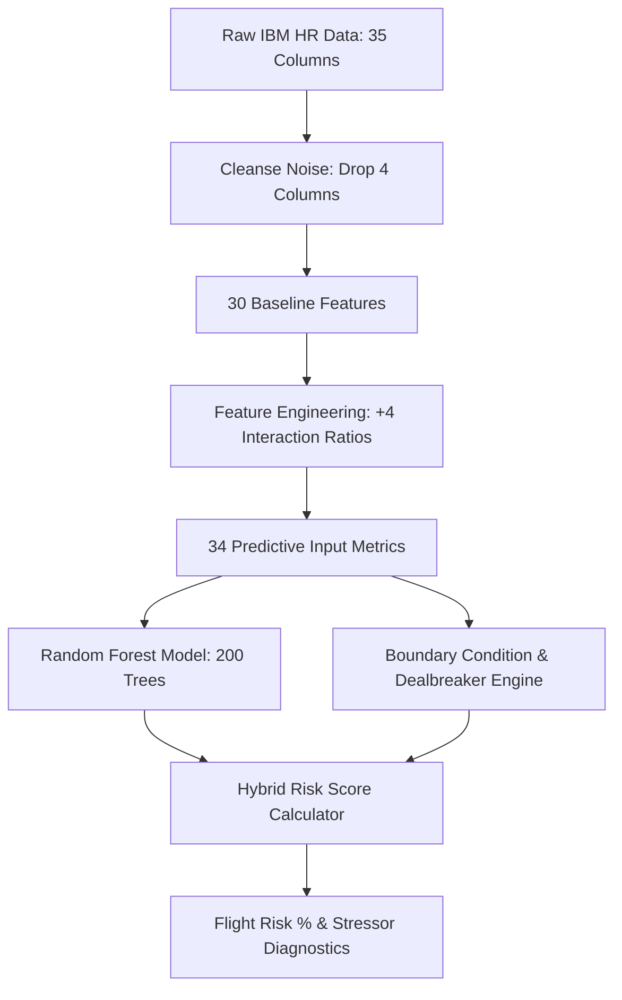
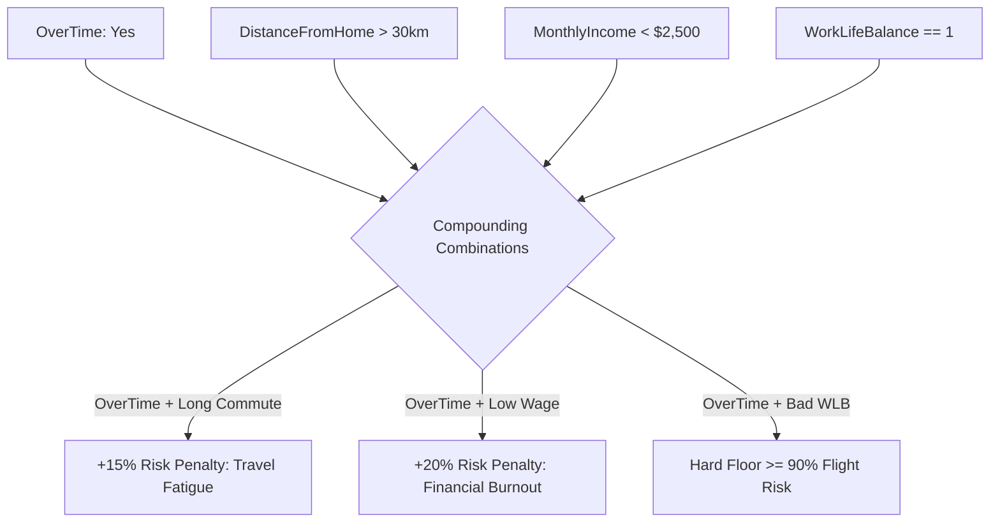

# 📊 R.E.T.A.I.N. — 34 Feature Metrics & Influence Guide

> **Risk Evaluation Tool for Attrition Insights & Navigation**  
> Complete technical reference and domain dictionary for all **34 predictive metrics** utilized by the Random Forest classifier and the Point-of-No-Return Boundary Condition Engine.

---

## 📑 Table of Contents
1. [Overview & Architecture](#overview--architecture)
2. [Global Feature Importance & Influence Matrix](#global-feature-importance--influence-matrix)
3. [Deep Dive: All 34 Feature Metrics](#deep-dive-all-34-feature-metrics)
   - [Category 1: Custom Engineered Domain Interaction Ratios](#category-1-custom-engineered-domain-interaction-ratios-4-features)
   - [Category 2: Compensation, Financial Incentives & Equity](#category-2-compensation-financial-incentives--equity-6-features)
   - [Category 3: Workload, Psychometrics & Morale](#category-3-workload-psychometrics--morale-6-features)
   - [Category 4: Experience, Tenure & Seniority History](#category-4-experience-tenure--seniority-history-6-features)
   - [Category 5: Workplace Logistics & Travel](#category-5-workplace-logistics--travel-2-features)
   - [Category 6: Department, Role & Hierarchy](#category-6-department-role--hierarchy-4-features)
   - [Category 7: Demographics & Background](#category-7-demographics--background-4-features)
   - [Category 8: Performance & Career Development](#category-8-performance--career-development-2-features)
4. [Cleansed & Dropped Raw Columns](#cleansed--dropped-raw-columns)
5. [Cross-Feature Interaction & Compounding Multipliers](#cross-feature-interaction--compounding-multipliers)

---

## 1. Overview & Architecture

The raw dataset originated from the IBM HR Analytics Employee Attrition benchmark (35 initial attributes). During the data preprocessing pipeline (`src/data_preprocessing.py`):
- **4 non-predictive attributes** were removed (zero-variance constants and random identifiers).
- **4 domain interaction ratios** were mathematically derived to capture non-linear behavioral stress.
- **Result**: Exactly **34 predictive input metrics** fed simultaneously into the **Random Forest ensemble** ($200$ trees) and the **Hybrid Boundary Condition Engine**.

---

## 2. Global Feature Importance & Influence Matrix

Below is the complete Gini Feature Importance ranking extracted directly from the trained `RandomForestClassifier` (`models/retain_rf_model.pkl`), alongside directional influence and boundary enforcement:

| Rank | Feature Metric | Category | Gini Importance | Directional Impact on Attrition | Boundary Condition Floor? |
| :---: | :--- | :--- | :---: | :---: | :---: |
| **1** | `Job_Hopping_Index` | Engineered Ratio | **6.81%** | ⬆️ Higher ratio = Higher Risk | Multiplier with Low Satisfaction |
| **2** | `MonthlyIncome` | Compensation | **5.92%** | ⬇️ Higher income = Lower Risk | **Hard Floor $\ge 98\%$** if $<\$1,000$ |
| **3** | `Age` | Demographics | **5.47%** | ⬇️ Older age = Lower Risk | Compounded with Junior Role |
| **4** | `Income_per_JobLevel` | Engineered Ratio | **5.03%** | ⬇️ Higher ratio = Lower Risk | Underpayment Penalty ($< \$1,500$) |
| **5** | `OverTime` | Workload | **4.66%** | ⬆️ Yes = Substantially Higher Risk | **Hard Floor $\ge 90\%$** with WLB=1 |
| **6** | `TotalWorkingYears` | Tenure History | **4.53%** | ⬇️ More years = Lower Risk | Baseline Career Stability Factor |
| **7** | `Satisfaction_Score` | Engineered Ratio | **4.51%** | ⬇️ Higher score = Lower Risk | **Hard Floor $\ge 88\%$** if $< 1.5$ |
| **8** | `DailyRate` | Compensation | **4.48%** | ⬇️ Higher rate = Lower Risk | Minor Financial Factor |
| **9** | `MonthlyRate` | Compensation | **3.97%** | ⬇️ Higher rate = Lower Risk | Operational Financial Factor |
| **10** | `DistanceFromHome` | Logistics | **3.80%** | ⬆️ Longer commute = Higher Risk | **Hard Floor $\ge 92\%$** if $\ge 80\text{km}$ |
| **11** | `Tenure_Ratio` | Engineered Ratio | **3.79%** | ⬇️ Higher ratio = Lower Risk | Loyalty vs. Early Flight Index |
| **12** | `YearsAtCompany` | Tenure History | **3.76%** | ⬇️ Longer tenure = Lower Risk | Retention Anchor |
| **13** | `HourlyRate` | Compensation | **3.59%** | ⬇️ Higher wage = Lower Risk | Base Rate Metric |
| **14** | `YearsWithCurrManager` | Tenure History | **3.41%** | ⬇️ Longer with manager = Lower Risk | Managerial Retention Anchor |
| **15** | `StockOptionLevel` | Compensation | **3.23%** | ⬇️ Higher options = Lower Risk | "Golden Handcuff" Financial Anchor |
| **16** | `PercentSalaryHike` | Compensation | **2.70%** | ⬇️ Higher hike = Lower Risk | Recognition / Incentive Factor |
| **17** | `JobRole` | Hierarchy | **2.59%** | Categorical Variance | Sales Reps & Lab Techs at highest risk |
| **18** | `NumCompaniesWorked` | Tenure History | **2.46%** | ⬆️ More employers = Higher Risk | Baseline Mobility Indicator |
| **19** | `YearsInCurrentRole` | Tenure History | **2.26%** | ⬇️ Moderate/high = Lower Risk | Role Stagnation Risk if extreme |
| **20** | `EnvironmentSatisfaction` | Psychometrics | **2.20%** | ⬇️ Higher = Lower Risk | Component of Holistic Morale |
| **21** | `JobLevel` | Hierarchy | **2.16%** | ⬇️ Higher level = Lower Risk | Seniority & Status Anchor |
| **22** | `MaritalStatus` | Demographics | **1.97%** | Singles > Married/Divorced | Mobility Flexibility Factor |
| **23** | `YearsSinceLastPromotion`| Tenure History | **1.90%** | ⬆️ Longer stall = Higher Risk | Promotion Ceiling Stressor |
| **24** | `TrainingTimesLastYear` | Progression | **1.77%** | ⬇️ Moderate (2-4) = Lower Risk | Low training = Skill stagnation |
| **25** | `JobSatisfaction` | Psychometrics | **1.77%** | ⬇️ Higher = Lower Risk | Role Enjoyment Factor |
| **26** | `RelationshipSatisfaction`| Psychometrics | **1.76%** | ⬇️ Higher = Lower Risk | Peer / Social Dynamics Factor |
| **27** | `WorkLifeBalance` | Psychometrics | **1.70%** | ⬇️ Higher = Lower Risk | Burnout Buffer ($1 = \text{Bad}$) |
| **28** | `JobInvolvement` | Psychometrics | **1.65%** | ⬇️ Higher = Lower Risk | Psychological Investment |
| **29** | `Education` | Demographics | **1.55%** | Minor Influence | Educational Qualification |
| **30** | `EducationField` | Hierarchy | **1.36%** | Minor Influence | Technical/Marketing vs Life Sciences |
| **31** | `Department` | Hierarchy | **1.13%** | Sales > HR > R&D | Division-level Attrition Variance |
| **32** | `BusinessTravel` | Logistics | **1.12%** | ⬆️ Frequent travel = Higher Risk | Compounding Travel Fatigue |
| **33** | `Gender` | Demographics | **0.72%** | Minimal Influence | Demographic Baseline |
| **34** | `PerformanceRating` | Progression | **0.28%** | Minimal Direct Influence | High rating without hike = Frustration |

---

## 3. Deep Dive: All 34 Feature Metrics

---

### Category 1: Custom Engineered Domain Interaction Ratios (4 Features)

#### 1. `Job_Hopping_Index`
* **Formula**: $\frac{\text{NumCompaniesWorked}}{\text{TotalWorkingYears} + 1}$
* **Type**: Continuous Float ($\ge 0.0$)
* **Model Importance**: **6.81%** (Rank #1 overall)
* **Definition**: Measures historical career velocity and average frequency of employer transitions.
* **Influence on Attrition**:
  - **High Value ($> 0.6$)**: Indicates the employee changes companies roughly every 1–2 years. This is the single strongest statistical predictor that an employee will jump ship when presented with an external offer.
  - **Low Value ($< 0.15$)**: Reflects steady long-term loyalty and low external career wanderlust.
* **Boundary Condition**: When `Job_Hopping_Index` $> 0.5$ AND `Satisfaction_Score` $< 2.5$, the engine applies an aggressive risk multiplier ($1.25\times$).

---

#### 2. `Income_per_JobLevel`
* **Formula**: $\frac{\text{MonthlyIncome}}{\text{JobLevel} + 1}$
* **Type**: Continuous Float (e.g., $\$250 - \$10,000+$)
* **Model Importance**: **5.03%** (Rank #4 overall)
* **Definition**: Quantifies compensation equity relative to executive responsibility and corporate hierarchy.
* **Influence on Attrition**:
  - **Low Value ($< \$1,500/\text{tier}$)**: Represents "responsibility exploitation" (e.g., Job Level 3 or 4 carrying high workload and management obligations while earning entry-level wages). These employees have acute flight risk because their market value far exceeds their internal pay.
  - **High Value ($> \$3,500/\text{tier}$)**: Well-compensated relative to rank, creating strong retention lock-in.

---

#### 3. `Satisfaction_Score`
* **Formula**: $\frac{\text{JobSatisfaction} + \text{EnvironmentSatisfaction} + \text{RelationshipSatisfaction} + \text{WorkLifeBalance}}{4.0}$
* **Type**: Continuous Float ($1.0$ to $4.0$)
* **Model Importance**: **4.51%** (Rank #7 overall)
* **Definition**: Unified composite psychometric index aggregating workplace happiness across psychological, environmental, interpersonal, and lifestyle dimensions.
* **Influence on Attrition**:
  - **Severe Toxic Morale ($< 1.5$)**: Triggers a hard boundary floor ($\ge 88\%$ risk). When all 4 psychometric pillars collapse, retention interventions rarely succeed.
  - **Balanced State ($> 3.2$)**: Acts as a protective shield against headhunters, even under moderate compensation pressure.

---

#### 4. `Tenure_Ratio`
* **Formula**: $\frac{\text{YearsAtCompany}}{\text{TotalWorkingYears} + 1}$
* **Type**: Continuous Float ($0.0$ to $1.0$)
* **Model Importance**: **3.79%** (Rank #11 overall)
* **Definition**: The proportion of an employee's total career spent at the current enterprise.
* **Influence on Attrition**:
  - **High Ratio ($> 0.7$)**: Deep cultural integration, strong internal network, and high switching friction, leading to significantly lower attrition probability.
  - **Low Ratio ($< 0.15$)**: Recent lateral hires who have not yet developed deep organizational ties; highly susceptible to leaving within their first 18 months.

---

### Category 2: Compensation, Financial Incentives & Equity (6 Features)

#### 5. `MonthlyIncome`
* **Type**: Continuous Integer ($\$1,009 - \$19,999$)
* **Model Importance**: **5.92%** (Rank #2 overall)
* **Definition**: Gross monthly base salary in USD.
* **Influence on Attrition**:
  - Strong inverse correlation with turnover. Employees earning under $\$3,000/\text{mo}$ experience disproportionately high financial attrition.
  - **Boundary Dealbreaker Floor**: Any salary below extreme subsistence levels ($<\$1,000/\text{mo}$) triggers a **hard risk floor of $\ge 98\%$**, overriding all other positive variables.

---

#### 6. `StockOptionLevel`
* **Type**: Ordinal Integer ($0, 1, 2, 3$)
* **Model Importance**: **3.23%** (Rank #15)
* **Definition**: The equity ownership and vesting tranche assigned to the employee.
* **Influence on Attrition**:
  - **Level 0 (No Options)**: Employees have zero unvested financial upside tied to company success, making them highly vulnerable to poaching.
  - **Levels 1–3**: Functions as "golden handcuffs." Unvested stock equity creates financial switching costs that deter voluntary resignations.

---

#### 7. `PercentSalaryHike`
* **Type**: Continuous Integer ($11\% - 25\%$)
* **Model Importance**: **2.70%** (Rank #16)
* **Definition**: Percentage base pay increase awarded during the most recent performance cycle.
* **Influence on Attrition**:
  - Hikes $< 12\%$ communicate stagnation or lack of recognition, driving employees to seek external compensation resets (which typically yield $15\%-25\%$ increases).

---

#### 8. `DailyRate`
* **Type**: Continuous Integer ($\$102 - \$1,499$)
* **Model Importance**: **4.48%** (Rank #8)
* **Definition**: Baseline daily billing / compensation equivalent.
* **Influence on Attrition**: Provides granularity into non-salary contractor/per-diem earning potential; lower rates slightly increase turnover probability.

---

#### 9. `MonthlyRate`
* **Type**: Continuous Integer ($\$2,094 - \$26,999$)
* **Model Importance**: **3.97%** (Rank #9)
* **Definition**: Internal organizational overhead and enterprise billing rate.
* **Influence on Attrition**: Minor secondary compensation feature that captures enterprise valuation of the role.

---

#### 10. `HourlyRate`
* **Type**: Continuous Integer ($\$30 - \$100$)
* **Model Importance**: **3.59%** (Rank #13)
* **Definition**: Contractual hourly labor rate.
* **Influence on Attrition**: Interacts with overtime hours to determine total take-home pay adequacy.

---

### Category 3: Workload, Psychometrics & Morale (6 Features)

#### 11. `OverTime`
* **Type**: Binary Categorical (`Yes` $= 1$, `No` $= 0$)
* **Model Importance**: **4.66%** (Rank #5 overall)
* **Definition**: Whether the employee regularly performs uncompensated or mandatory extra hours.
* **Influence on Attrition**:
  - The single highest behavioral turnover catalyst. Working overtime doubles the baseline odds of attrition.
  - **Boundary Dealbreaker**: When `OverTime == 'Yes'` AND `WorkLifeBalance == 1`, the engine triggers a **$\ge 90\%$ hard burnout floor**.

---

#### 12. `WorkLifeBalance`
* **Type**: Ordinal Integer ($1 = \text{Bad}, 2 = \text{Good}, 3 = \text{Better}, 4 = \text{Best}$)
* **Model Importance**: **1.70%** (Rank #27)
* **Definition**: Self-reported ability to reconcile workload demands with personal health and family life.
* **Influence on Attrition**: Level 1 (Bad) acts as a primary catalyst for mental fatigue and burnout.

---

#### 13. `JobSatisfaction`
* **Type**: Ordinal Integer ($1 = \text{Low}, 2 = \text{Medium}, 3 = \text{High}, 4 = \text{Very High}$)
* **Model Importance**: **1.77%** (Rank #25)
* **Definition**: Personal enjoyment, intellectual engagement, and fulfillment derived from daily job duties.
* **Influence on Attrition**: Low satisfaction directly drives passive and active resume distribution.

---

#### 14. `EnvironmentSatisfaction`
* **Type**: Ordinal Integer ($1 = \text{Low}, 2 = \text{Medium}, 3 = \text{High}, 4 = \text{Very High}$)
* **Model Importance**: **2.20%** (Rank #20)
* **Definition**: Perceived health of physical office conditions, tools, psychological safety, and organizational culture.
* **Influence on Attrition**: Toxic physical or cultural environments lead to rapid early-tenure resignations.

---

#### 15. `RelationshipSatisfaction`
* **Type**: Ordinal Integer ($1 = \text{Low}, 2 = \text{Medium}, 3 = \text{High}, 4 = \text{Very High}$)
* **Model Importance**: **1.76%** (Rank #26)
* **Definition**: Quality of interpersonal trust and collaboration with peers, cross-functional partners, and superiors.
* **Influence on Attrition**: Interpersonal workplace friction creates social isolation, accelerating departure intent.

---

#### 16. `JobInvolvement`
* **Type**: Ordinal Integer ($1 = \text{Low}, 2 = \text{Medium}, 3 = \text{High}, 4 = \text{Very High}$)
* **Model Importance**: **1.65%** (Rank #28)
* **Definition**: Degree of psychological identity and personal dedication invested in work outcomes.
* **Influence on Attrition**: Disengaged employees (`JobInvolvement == 1`) "quiet quit" and accept lateral recruiter inquiries with zero friction.

---

### Category 4: Experience, Tenure & Seniority History (6 Features)

#### 17. `TotalWorkingYears`
* **Type**: Continuous Integer ($0 - 40\text{ years}$)
* **Model Importance**: **4.53%** (Rank #6 overall)
* **Definition**: Total cumulative professional career experience across all organizations.
* **Influence on Attrition**:
  - Early-career professionals ($< 3\text{ years}$) exhibit the highest industry mobility.
  - Senior professionals ($> 15\text{ years}$) exhibit strong career inertia and lower flight risk.

---

#### 18. `YearsAtCompany`
* **Type**: Continuous Integer ($0 - 40\text{ years}$)
* **Model Importance**: **3.76%** (Rank #12)
* **Definition**: Total continuous years spent employed at the current enterprise.
* **Influence on Attrition**: Attrition peaks sharply at Year 1 and Year 2 (the "onboarding cliff") and stabilizes substantially after Year 5.

---

#### 19. `YearsWithCurrManager`
* **Type**: Continuous Integer ($0 - 17\text{ years}$)
* **Model Importance**: **3.41%** (Rank #14)
* **Definition**: Duration reporting directly to the current supervisor.
* **Influence on Attrition**: Validates the HR adage *"People leave managers, not companies."* Attrition spikes when `YearsWithCurrManager == 0` (due to recent re-orgs or managerial friction).

---

#### 20. `NumCompaniesWorked`
* **Type**: Continuous Integer ($0 - 9$)
* **Model Importance**: **2.46%** (Rank #18)
* **Definition**: Number of distinct past employers prior to current tenure.
* **Influence on Attrition**: High past transitions normalize external job switching as a career growth mechanism.

---

#### 21. `YearsInCurrentRole`
* **Type**: Continuous Integer ($0 - 18\text{ years}$)
* **Model Importance**: **2.26%** (Rank #19)
* **Definition**: Time spent executing the current specific job description without a title change.
* **Influence on Attrition**: Stagnation beyond 4–6 years without role evolution leads to boredom, disengagement, and external search.

---

#### 22. `YearsSinceLastPromotion`
* **Type**: Continuous Integer ($0 - 15\text{ years}$)
* **Model Importance**: **1.90%** (Rank #23)
* **Definition**: Time elapsed since the employee's last formal upward career elevation.
* **Influence on Attrition**: High values ($> 5\text{ years}$) signal a perceived "glass ceiling," driving high performers to seek promotion through external recruitment.

---

### Category 5: Workplace Logistics & Travel (2 Features)

#### 23. `DistanceFromHome`
* **Type**: Continuous Integer ($1 - 29\text{ km/miles}$ in training; evaluated up to $100+\text{km}$)
* **Model Importance**: **3.80%** (Rank #10)
* **Definition**: One-way distance from home to workplace.
* **Influence on Attrition**:
  - Linear increase in attrition risk up to 30km.
  - **Hard Dealbreaker Floor**: Commutes $\ge 80\text{km}$ trigger a **$\ge 92\%$ risk floor** due to daily physical exhaustion and unsustainable travel time.
  - **Coupled Multiplier**: Commutes $> 30\text{km}$ combined with `OverTime == 'Yes'` trigger a $+15\%$ compounded risk boost.

---

#### 24. `BusinessTravel`
* **Type**: Categorical (`Non-Travel`, `Travel_Rarely`, `Travel_Frequently`)
* **Model Importance**: **1.12%** (Rank #32)
* **Definition**: Mandatory frequency of client and cross-office travel.
* **Influence on Attrition**: Frequent travel accelerates personal burnout when uncompensated by high salary or flexible rest days.

---

### Category 6: Department, Role & Hierarchy (4 Features)

#### 25. `JobRole`
* **Type**: Categorical ($9\text{ distinct roles}$)
* **Model Importance**: **2.59%** (Rank #17)
* **Definition**: Formal functional job title.
* **Attrition Risk Hierarchy**:
  1. *Sales Representative* (Highest industry turnover due to quota pressure and commission volatility)
  2. *Laboratory Technician* (High workload, moderate pay)
  3. *Human Resources*
  4. *Sales Executive*
  5. *Research Scientist*
  6. *Manufacturing Director* / *Manager* (Lowest turnover)

---

#### 26. `JobLevel`
* **Type**: Ordinal Integer ($1 = \text{Junior} \dots 5 = \text{Executive}$)
* **Model Importance**: **2.16%** (Rank #21)
* **Definition**: Seniority rank within the organizational hierarchy.
* **Influence on Attrition**: Level 1 (Junior) employees have fewer exit friction costs and higher mobility; Level 4–5 executives have high retention stability.

---

#### 27. `EducationField`
* **Type**: Categorical (`Life Sciences`, `Medical`, `Marketing`, `Technical Degree`, `Human Resources`, `Other`)
* **Model Importance**: **1.36%** (Rank #30)
* **Definition**: College or university major.
* **Influence on Attrition**: Marketing and Technical graduates show slightly higher external market demand compared to specialized Life Science roles.

---

#### 28. `Department`
* **Type**: Categorical (`Sales`, `Research & Development`, `Human Resources`)
* **Model Importance**: **1.13%** (Rank #31)
* **Definition**: Business division.
* **Influence on Attrition**: Sales divisions historically exhibit roughly $2\times$ the baseline attrition rate of R&D engineering teams.

---

### Category 7: Demographics & Background (4 Features)

#### 29. `Age`
* **Type**: Continuous Integer ($18 - 60\text{ years}$)
* **Model Importance**: **5.47%** (Rank #3 overall)
* **Definition**: Chronological age in years.
* **Influence on Attrition**:
  - Young workforce ($18 - 28$) has peak flight risk due to career exploration and lower familial ties.
  - Mid-to-late career ($40 - 60$) shows high stability and strong pension/equity ties.

---

#### 30. `MaritalStatus`
* **Type**: Categorical (`Single`, `Married`, `Divorced`)
* **Model Importance**: **1.97%** (Rank #22)
* **Definition**: Legal marital standing.
* **Influence on Attrition**: Single employees exhibit $1.8\times$ higher turnover than Married/Divorced peers due to higher relocation flexibility.

---

#### 31. `Education`
* **Type**: Ordinal Integer ($1 = \text{Below College}, 2 = \text{College}, 3 = \text{Bachelor}, 4 = \text{Master}, 5 = \text{Doctor}$)
* **Model Importance**: **1.55%** (Rank #29)
* **Definition**: Highest level of formal completed education.
* **Influence on Attrition**: Highly educated staff (Master/Doctorate) demand rapid career trajectory alignment and will depart if under-challenged.

---

#### 32. `Gender`
* **Type**: Categorical (`Male`, `Female`)
* **Model Importance**: **0.72%** (Rank #33)
* **Definition**: Demographic gender classification.
* **Influence on Attrition**: Minimal direct statistical variance on attrition probability; retained for demographic compliance and fair cohort auditing.

---

### Category 8: Performance & Career Development (2 Features)

#### 33. `TrainingTimesLastYear`
* **Type**: Continuous Integer ($0 - 6\text{ sessions}$)
* **Model Importance**: **1.77%** (Rank #24)
* **Definition**: Number of formal training and development sessions attended.
* **Influence on Attrition**:
  - $0$ trainings: Employee feels neglected with no upskilling path.
  - $2 - 4$ trainings: Optimal retention sweet spot.
  - $5+$ trainings: Can occasionally trigger departure if employees leverage new certifications for external market offers.

---

#### 34. `PerformanceRating`
* **Type**: Ordinal Integer ($3 = \text{Excellent}, 4 = \text{Outstanding}$)
* **Model Importance**: **0.28%** (Rank #34)
* **Definition**: Formal annual performance review grade.
* **Influence on Attrition**:
  - Low direct linear importance because the dataset only captures top ratings (3 and 4).
  - High contextual impact: Outstanding performers ($4$) receiving low salary hikes ($<12\%$) experience acute frustration and leave quickly.

---

## 4. Cleansed & Dropped Raw Columns

During the data cleansing phase in `src/data_preprocessing.py`, **4 columns** from the original IBM dataset were dropped before training:

| Dropped Column | Reason for Removal | Data Science Rationale |
| :--- | :--- | :--- |
| **`EmployeeCount`** | Zero-variance constant ($1$ for all rows) | Provides zero statistical information gain; useless to decision trees. |
| **`StandardHours`** | Zero-variance constant ($80$ for all rows) | Invariant across the entire workforce; zero predictive entropy. |
| **`Over18`** | Zero-variance constant (`Y` for all rows) | All recorded staff are legal adults; contains zero variance. |
| **`EmployeeNumber`** | Arbitrary sequential identifier | Pure random noise. If included, trees would memorize IDs rather than learning generalizable behavioral patterns (overfitting). |

---

## 5. Cross-Feature Interaction & Compounding Multipliers

In real-world human behavior, factors rarely act in isolation. The R.E.T.A.I.N. engine integrates an **Independent Boundary Condition & Multiplier Engine** (`src/api_gateway.py`) that applies non-linear rules when specific metrics compound:

### Key Compounding Rules
1. **The Commute Dealbreaker**: $\text{DistanceFromHome} \ge 80\text{km} \implies \text{Floor}(\ge 92\%)$.
2. **The Unlivable Wage Dealbreaker**: $\text{MonthlyIncome} < \$1,000/\text{mo} \implies \text{Floor}(\ge 98\%)$.
3. **The Toxic Workload Dealbreaker**: $\text{OverTime} == \text{Yes} \land \text{WorkLifeBalance} == 1 \implies \text{Floor}(\ge 90\%)$.
4. **The Complete Morale Collapse**: $\text{Satisfaction\_Score} < 1.5 \implies \text{Floor}(\ge 88\%)$.
5. **The Flight-Risk Multiplier**: $\text{Job\_Hopping\_Index} > 0.5 \land \text{Satisfaction\_Score} < 2.5 \implies 1.25\times \text{Multiplier}$.
