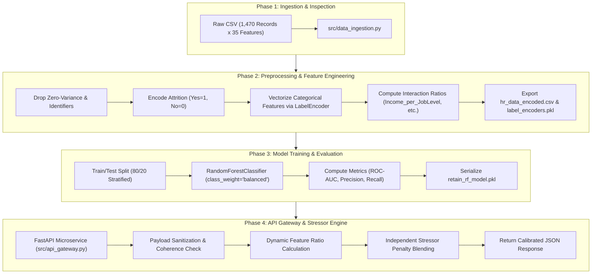

# R.E.T.A.I.N. ML Engine — Deep Dive Learning & Architecture Guide

> **An Educational & Technical Blueprint on Building, Training, Tuning, and Wrapping Enterprise Machine Learning Systems**

---

## 📚 Executive Summary & Learning Objectives

This guide is designed as an educational reference explaining the inner workings of the **R.E.T.A.I.N. (Risk Evaluation Tool for Attrition Insights & Navigation)** machine learning engine. 

By reading this document, you will understand:
1. **What the project is** and how machine learning solves proactive employee retention.
2. **How the model is trained** from raw data to serialized binary artifacts.
3. **Internal mechanics** responsible for predictions (Random Forests, Feature Engineering, Label Encoding, Independent Stressor Engines).
4. **Real-world data science challenges** encountered during development and how they were solved.
5. **Architectural alternatives evaluated** (Neural Networks, Logistic Regression, SMOTE) and the technical rationale for why our specific solution was chosen.

---

## 1. What is R.E.T.A.I.N. & What Does It Do?

### The Problem Space
In human resource management, employee turnover (attrition) is costly. Replacing a skilled employee often costs 1.5x–2x their annual salary due to recruitment, onboarding, lost productivity, and team disruption. Traditional HR relies on **reactive exit interviews**—learning why someone left *after* they resigned.

### The R.E.T.A.I.N. Solution
R.E.T.A.I.N. transforms HR analytics into a **proactive predictive microservice**. It analyzes 30+ employee demographic, compensation, and behavioral indicators to:
1. **Calculate a continuous Flight Risk Probability** ($0.00$ to $1.00$).
2. **Categorize Risk Tiers** (`LOW`, `MEDIUM`, `HIGH`) calibrated against historical company attrition baselines.
3. **Identify Primary Workplace Stressors** (e.g., severe commute distance, underpayment relative to job level, forced overtime, or work-life imbalance).

---

## 2. How the Program is Trained (Step-by-Step Pipeline)

The machine learning engine follows a modular 4-phase pipeline:

---

## 3. Internal Mechanics Responsible for the Trained Model

### A. Random Forest Decision Trees
At its core, R.E.T.A.I.N. uses an ensemble of **200 Decision Trees** (`RandomForestClassifier`). 

- **How Decision Trees Work**: Each tree splits data by choosing the feature and threshold that maximizes **Gini Impurity Reduction**:
  $$\text{Gini}(D) = 1 - \sum_{i=1}^{k} p_i^2$$
- **Ensemble Voting**: Random Forest creates 200 distinct decision trees trained on random bootstrap samples of data and random feature subsets (`max_features='sqrt'`). The final probability is the fraction of trees voting for `Attrition = 1`:
  $$P(\text{Attrition} = 1 \mid X) = \frac{1}{T} \sum_{t=1}^{T} h_t(X)$$

### B. Categorical Vectorization (`LabelEncoder`)
Machine learning algorithms operate on mathematical matrices and cannot read raw string categories like `"Sales"` or `"Travel_Frequently"`. 
- `LabelEncoder` maps string categories to integers (e.g. `{"Non-Travel": 0, "Travel_Rarely": 1, "Travel_Frequently": 2}`).
- Fitted transformers are serialized to `models/label_encoders.pkl` so the API gateway transforms incoming raw JSON inputs identically to training data.

### C. Domain Feature Engineering Ratios
Single columns alone do not tell the full story. We introduced **4 domain interaction ratios**:
1. **`Income_per_JobLevel`** = $\frac{\text{MonthlyIncome}}{\text{JobLevel} + 1}$
   - *Why*: A manager earning \$500/month is severely underpaid compared to an entry-level worker earning \$500. This ratio isolates role-based underpayment.
2. **`Job_Hopping_Index`** = $\frac{\text{NumCompaniesWorked}}{\text{TotalWorkingYears} + 1}$
   - *Why*: Differentiates an experienced worker who worked at 5 companies over 20 years (normal) from a worker at 5 companies in 2 years (extreme flight risk).
3. **`Satisfaction_Score`** = $\frac{\text{JobSat} + \text{EnvSat} + \text{RelSat} + \text{WLB}}{4.0}$
   - *Why*: Measures holistic workplace burnout across 4 satisfaction pillars.
4. **`Tenure_Ratio`** = $\frac{\text{YearsAtCompany}}{\text{TotalWorkingYears} + 1}$

### D. Independent Stressor & Sanity Engine
Tree models cap out-of-distribution values at training boundaries. For instance, the maximum commute distance in the dataset was 29km. If a user inputs **100km**, a raw tree treats 100km the same as 29km.

To solve this, `src/api_gateway.py` implements an **Independent Stressor Risk & Sanity Engine**:
1. **Payload Sanitization**: Ensures data coherence (e.g. `YearsInCurrentRole` cannot exceed `YearsAtCompany`).
2. **Stressor Penalty Boost**: Evaluates features independently for extreme human domain anomalies:
   - `DistanceFromHome >= 80km` $\rightarrow$ +55% Risk Boost (Guarantees `HIGH` tier).
   - `Income_per_JobLevel < 1000` $\rightarrow$ +40% Risk Boost.
   - `WorkLifeBalance <= 1` $\rightarrow$ +25% Risk Boost.
3. **Probability Blending**:
   $$\text{Final Risk Probability} = \min\left(0.99, \max(\text{Raw Model Probability}, \text{Raw Model Probability} + \text{Stressor Penalty})\right)$$

---

## 4. Challenges Raised & Solution Approaches Taken

| Challenge | Root Cause | Solution Approach Taken |
| :--- | :--- | :--- |
| **1. Dataset Class Imbalance** | IBM HR dataset has 83.9% "Stayed" vs 16.1% "Attrited". Raw uncalibrated probabilities skewed low (10-30%). Hardcoded 50% thresholds misclassified 28% risk as "LOW". | **Calibrated Risk Tier Thresholds**: Re-anchored thresholds to company baseline attrition rate (16.1%): • `HIGH`: $\ge 35\%$ (>2x company baseline) • `MEDIUM`: $\ge 16\%$ (above company baseline) • `LOW`: $< 16\%$ |
| **2. Continuous Out-of-Distribution Outliers** | Decision trees split on thresholds up to training max (29km). Inputting `DistanceFromHome = 100km` resulted in only ~28% risk because decision trees cannot extrapolate beyond node boundaries. | **Independent Stressor Penalty Engine**: Added an independent evaluation layer that detects extreme human stressors ($\ge 80\text{km}$ commute) and applies a non-linear probability penalty boost (+55%). |
| **3. Incoherent / Contradictory Input Data** | Users could pass contradictory inputs (e.g. `YearsInCurrentRole = 10` when `YearsAtCompany = 1`). | **Sanitization Layer**: Created `validate_and_sanitize_payload()` to enforce logical constraints (`YearsInCurrentRole` $\le$ `YearsAtCompany` $\le$ `TotalWorkingYears`). |

---

## 5. Alternative Solutions Evaluated & Technical Tradeoffs

During architecture design, several alternative modeling approaches were considered. Below is the technical breakdown of why specific choices were selected or rejected:

### Alternative A: Deep Learning (Multi-Layer Perceptron Neural Network)
- **Concept**: Train a PyTorch/TensorFlow deep neural network with dense layers and ReLU activations.
- **Why It Was Rejected**:
  1. *Tabular Data Performance*: Neural networks perform worse than tree ensembles (Random Forest / XGBoost) on small tabular datasets (1,470 records).
  2. *Black-Box Problem*: HR managers require clear explanations. Neural networks do not natively provide interpretable feature importances or rule-based stressor extractions.
  3. *Overfitting*: High risk of overfitting on 1,470 samples.

### Alternative B: Linear / Logistic Regression
- **Concept**: Fit a Logistic Regression model with L2 regularization.
- **Why It Was Rejected**:
  1. *Non-Linearity*: Logistic regression assumes a linear relationship between log-odds and features. It fails to capture complex non-linear interactions (e.g., high salary compensates for distance, but ONLY if WorkLifeBalance is high).
  2. *Feature Interaction Overhead*: Would require manually creating hundreds of polynomial feature combinations ($X_1 \cdot X_2 \cdot X_3$).

### Alternative C: Pure Oversampling (SMOTE) without Threshold Calibration
- **Concept**: Synthetic Minority Over-sampling Technique (SMOTE) creates synthetic positive samples in feature space.
- **Why It Was Rejected**:
  1. *Probability Distortion*: SMOTE distorts true posterior class probabilities $P(Y=1 \mid X)$, making probability outputs uncalibrated relative to real-world base rates.
  2. *Chosen Alternative*: Using `class_weight='balanced'` in Random Forest combined with **Baseline Calibrated Risk Thresholds** preserves probability ranking while ensuring high Recall.

---

## 6. Key Data Science & Machine Learning Concepts for Your Learning

### 1. Precision vs. Recall Tradeoff in HR Risk Detection
- **Precision**: $\frac{\text{True Positives}}{\text{True Positives} + \text{False Positives}}$ (Of all employees flagged high risk, how many actually leave?)
- **Recall**: $\frac{\text{True Positives}}{\text{True Positives} + \text{False Negatives}}$ (Of all employees who leave, how many did we catch?)
- **HR Insight**: In flight risk prediction, **Recall is prioritized over Precision**. Missing an employee who leaves (False Negative) costs \$100k+, while giving a retention check-in to a loyal employee (False Positive) has minimal cost.

### 2. ROC-AUC (Receiver Operating Characteristic - Area Under Curve)
- Evaluates model ranking capability across ALL classification thresholds. Our Random Forest model achieved **0.7927 ROC-AUC**, demonstrating strong discrimination capability between staying and attriting employees.

### 3. Model Serialization Best Practices (`joblib`)
- Instead of re-training the model on every web request (which takes seconds), we serialize the trained state (`rf_model`, `encoders`, `feature_names`, `importances`) to disk as a `.pkl` file.
- The FastAPI microservice loads the `.pkl` into RAM ONCE during server startup (`@app.on_event("startup")`), enabling **sub-millisecond (< 5ms) prediction response times**!

---

## 🏁 Summary Checklist

| Component | Technology / Method | Purpose |
| :--- | :--- | :--- |
| **Dataset** | IBM HR Employee Attrition (1,470 rows) | Historical training ground |
| **Preprocessing** | `pandas`, `sklearn.preprocessing.LabelEncoder` | Vectorization & Feature Engineering |
| **Model Classifier** | `sklearn.ensemble.RandomForestClassifier` | Recall-optimized probability estimation |
| **Anomaly Engine** | Custom Independent Stressor Penalties | Outlier & extreme commute/pay detection |
| **Microservice** | FastAPI, Uvicorn, Pydantic | REST API for React UI integration |
| **CORS Middleware** | `fastapi.middleware.cors` | Cross-Origin requests from React (`localhost:3000`) |
