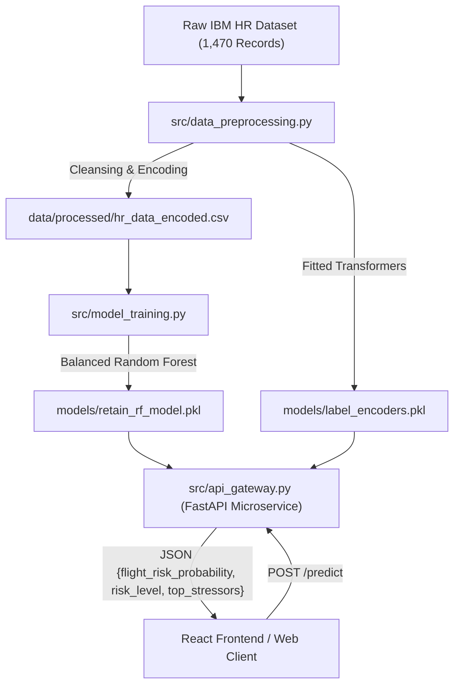

# R.E.T.A.I.N. Machine Learning Engine

> **Risk Evaluation Tool for Attrition Insights & Navigation (R.E.T.A.I.N.)**
> Proactive, predictive machine learning microservice for employee flight risk probability assessment and behavioral stressor identification.

---

## 📌 Project Overview

**R.E.T.A.I.N. ML Engine** is a high-performance machine learning backend designed to analyze historical HR analytics data, behavioral indicators, and demographic metrics to calculate continuous flight risk probabilities for employees. 

Engineered for seamless integration with modern web applications (such as React dashboards and enterprise APIs), R.E.T.A.I.N. wraps a trained, recall-optimized Random Forest model inside a lightweight FastAPI microservice complete with CORS middleware, dynamic feature engineering, and independent stressor anomaly detection.

---

## 🚀 Key Features

- **Predictive Flight Risk Scoring**: Outputs a continuous flight risk probability score ($0.00$ to $1.00$) and categorizes risk into `LOW`, `MEDIUM`, or `HIGH` tiers calibrated against baseline company attrition rates.
- **Automated Behavioral Stressor Identification**: Identifies the top 3 specific workplace or demographic stressors (e.g. `OverTime`, `MonthlyIncome`, `WorkLifeBalance`, `Job_Hopping_Index`) driving an employee's flight risk.
- **Domain Feature Engineering**: Dynamically calculates interaction ratios such as `Income_per_JobLevel`, `Job_Hopping_Index`, `Satisfaction_Score`, and `Tenure_Ratio`.
- **Independent Stressor & Outlier Engine**: Detects extreme human domain anomalies (e.g. an extreme $100\text{km}$ commute distance or severe role underpayment) and adjusts risk evaluations even if all other metrics appear safe.
- **RESTful FastAPI Microservice**: Fully typed, PEP 8 compliant, OpenAPI/Swagger documented, and pre-configured with CORS middleware for direct React frontend consumption.

---

## 🛠️ System Architecture



---

## 📁 Repository Structure

```text
retain_ml_engine/
├── .gitignore               # Git protection rules (ignores directives, venv, data, model binaries)
├── AGENT_DIRECTIVES.md      # Project specification & execution blueprint
├── LEARNING_GUIDE.md        # Comprehensive technical & data science deep dive guide
├── README.md                # Project documentation & usage guide
├── app.py                   # Full interactive Streamlit analytics & batch evaluation dashboard
├── predict_sample.py        # Terminal verification script with sample employee profiles
├── requirements.txt         # Python dependencies (pandas, scikit-learn, fastapi, streamlit, plotly)
├── data/
│   ├── raw/                 # Raw dataset (WA_Fn-UseC_-HR-Employee-Attrition.csv)
│   └── processed/           # Preprocessed dataset (hr_data_encoded.csv)
├── models/                  # Serialized model bundles & label encoders (.pkl)
├── test/                    # 5 Specialized test CSV datasets for batch evaluation
│   ├── 1_high_flight_risk_employees.csv
│   ├── 2_safe_retention_employees.csv
│   ├── 3_extreme_outliers_and_dealbreakers.csv
│   ├── 4_department_sales_team.csv
│   └── 5_mixed_workforce_cohort.csv
└── src/
    ├── data_ingestion.py    # Initial dataset loader & structural inspector
    ├── data_preprocessing.py# Data cleansing, label encoding, and feature engineering pipeline
    ├── model_training.py    # Random Forest model training, evaluation, and serialization
    └── api_gateway.py       # FastAPI microservice gateway with CORS & boundary engine
```

---

## ⚡ Quick Start & Installation

### 1. Prerequisites
- Python 3.10+ installed on your system.

### 2. Environment Setup
Clone the repository and set up a virtual environment:

```powershell
# Clone the repository
git clone https://github.com/Ajai-L/retain-ml-engine.git
cd retain_ml_engine

# Create and activate virtual environment
python -m venv .venv
.venv\Scripts\activate      # Windows (PowerShell)
# source .venv/bin/activate  # Linux/macOS

# Install dependencies
pip install -r requirements.txt
```

---

## 🖥️ Launching the Streamlit Web Dashboard

Start the full interactive visual dashboard in your browser:

```powershell
streamlit run app.py
```
Open **`http://localhost:8501`** to:
- Evaluate single employee flight risks with interactive sliders and quick-load presets.
- Drag-and-drop batch `.csv` files from the `test/` directory for team analytics.
- View global feature importance charts and model explainability insights.

---

## 🧪 Pipeline Execution & Verification

### Step 1: Preprocess Data
Run the preprocessing pipeline to cleanse noise, encode categorical features, and generate domain interaction ratios:

```powershell
python src/data_preprocessing.py
```

### Step 2: Train the ML Model
Train the Random Forest classifier and serialize the trained model bundle:

```powershell
python src/model_training.py
```

### Step 3: Run Instant Terminal Verification
Execute the verification script to inspect live model predictions across diverse employee profiles:

```powershell
python predict_sample.py
```

---

## 🌐 Running the FastAPI Microservice Gateway

Start the FastAPI backend server on `http://127.0.0.1:8000`:

```powershell
python -m uvicorn src.api_gateway:app --port 8000 --reload
```


### API Endpoints

#### 1. Health Check (`GET /health`)
- **URL**: `http://127.0.0.1:8000/health`
- **Response**:
  ```json
  {
    "status": "UP",
    "service": "RETAIN ML Engine API",
    "model_loaded": true
  }
  ```

#### 2. Flight Risk Prediction (`POST /predict`)
- **URL**: `http://127.0.0.1:8000/predict`
- **Headers**: `Content-Type: application/json`
- **Sample Request Payload**:
  ```json
  {
    "Age": 32,
    "BusinessTravel": "Travel_Frequently",
    "Department": "Sales",
    "DistanceFromHome": 25,
    "JobRole": "Sales Executive",
    "JobSatisfaction": 1,
    "MonthlyIncome": 2800,
    "OverTime": "Yes",
    "WorkLifeBalance": 1
  }
  ```
- **Sample Response Payload**:
  ```json
  {
    "flight_risk_probability": 0.8198,
    "risk_level": "HIGH",
    "top_stressors": [
      "OverTime",
      "JobSatisfaction",
      "WorkLifeBalance"
    ]
  }
  ```

#### Interactive Swagger UI Documentation
Open `http://127.0.0.1:8000/docs` in your browser to test endpoints interactively.

---

## 📘 Learning & Architecture Guide

For an in-depth explanation of how the ML model was built, internal mathematical mechanics, challenges faced (imbalanced class distributions, out-of-distribution continuous outliers), chosen vs alternative solutions, and data science concepts, read the detailed **[LEARNING_GUIDE.md](file:///c:/Work/Data%20Science/RETAIN_v1/retain_ml_engine/LEARNING_GUIDE.md)** document included in this repository.

---

## 📜 License & Author

- **Author**: Ajai L
- **Repository**: [Ajai-L/retain-ml-engine](https://github.com/Ajai-L/retain-ml-engine)
- **Project**: R.E.T.A.I.N. Predictive Analytics Microservice
